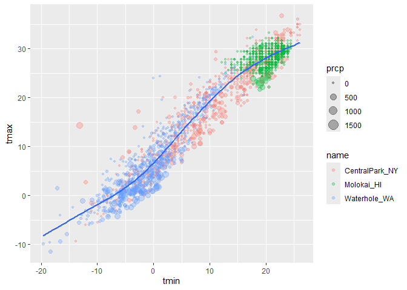
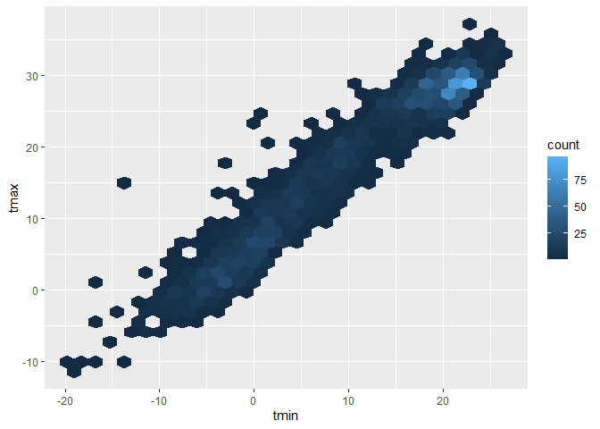
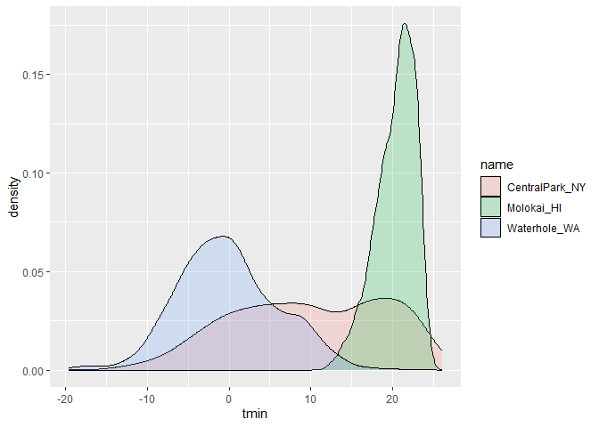

viz_1
================
2025-09-25

Import the weather data

``` r
data("weather_df")
```

Making out first plot

``` r
ggplot(data=weather_df, mapping = aes(x = tmin, y = tmax)) +
  geom_point() # aesthetic mapping get applied to geom_point arg
```

    ## Warning: Removed 17 rows containing missing values or values outside the scale range
    ## (`geom_point()`).

<!-- -->

``` r
               # normally people don't add data = or mapping = 
```

``` r
weather_df |> 
  ggplot(aes(x = tmin, y = tmax)) +
  geom_point()
```

    ## Warning: Removed 17 rows containing missing values or values outside the scale range
    ## (`geom_point()`).

<!-- -->

here we save in our env as object

``` r
ggp_weather_scatterplot =   
  weather_df |> 
  ggplot(aes(x = tmin, y = tmax)) +
  geom_point()
```

Check that some rows are missing

``` r
weather_df |> 
  filter(is.na(tmax))
```

    ## # A tibble: 17 × 6
    ##    name         id          date        prcp  tmax  tmin
    ##    <chr>        <chr>       <date>     <dbl> <dbl> <dbl>
    ##  1 Molokai_HI   USW00022534 2022-05-31    NA    NA    NA
    ##  2 Waterhole_WA USS0023B17S 2021-03-09    NA    NA    NA
    ##  3 Waterhole_WA USS0023B17S 2021-12-07    51    NA    NA
    ##  4 Waterhole_WA USS0023B17S 2021-12-31     0    NA    NA
    ##  5 Waterhole_WA USS0023B17S 2022-02-03     0    NA    NA
    ##  6 Waterhole_WA USS0023B17S 2022-08-09    NA    NA    NA
    ##  7 Waterhole_WA USS0023B17S 2022-08-10    NA    NA    NA
    ##  8 Waterhole_WA USS0023B17S 2022-08-11    NA    NA    NA
    ##  9 Waterhole_WA USS0023B17S 2022-08-12    NA    NA    NA
    ## 10 Waterhole_WA USS0023B17S 2022-08-13    NA    NA    NA
    ## 11 Waterhole_WA USS0023B17S 2022-08-14    NA    NA    NA
    ## 12 Waterhole_WA USS0023B17S 2022-08-15    NA    NA    NA
    ## 13 Waterhole_WA USS0023B17S 2022-08-16    NA    NA    NA
    ## 14 Waterhole_WA USS0023B17S 2022-08-17    NA    NA    NA
    ## 15 Waterhole_WA USS0023B17S 2022-08-18    NA    NA    NA
    ## 16 Waterhole_WA USS0023B17S 2022-08-19    NA    NA    NA
    ## 17 Waterhole_WA USS0023B17S 2022-12-31    76    NA    NA

## Fancier scatterplots

``` r
weather_df |> 
  ggplot(aes(x = tmin, y = tmax, color = name))+ #Adding color to the points
                                                 # aes is for mapping
  geom_point(alpha = 0.3) +                      # alpha changes the opacity
  geom_smooth(se = F)                            # adds smooth line, se = F gets rid of CI
```

    ## `geom_smooth()` using method = 'loess' and formula = 'y ~ x'

    ## Warning: Removed 17 rows containing non-finite outside the scale range
    ## (`stat_smooth()`).

    ## Warning: Removed 17 rows containing missing values or values outside the scale range
    ## (`geom_point()`).

<!-- -->

Where you define aes matters

``` r
weather_df |> 
  ggplot(aes(x = tmin, y = tmax))+ 
        # aes is for mapping
  geom_point(aes(color = name, size = prcp), alpha = 0.3, ) +  
        # alpha changes the opacity, only one color for line, changing size of point using size = prcp
  geom_smooth(se = F) 
```

    ## `geom_smooth()` using method = 'gam' and formula = 'y ~ s(x, bs = "cs")'

    ## Warning: Removed 17 rows containing non-finite outside the scale range
    ## (`stat_smooth()`).

    ## Warning: Removed 19 rows containing missing values or values outside the scale range
    ## (`geom_point()`).

<!-- -->

Use faceting

``` r
weather_df |> 
  ggplot(aes(x = tmin, y = tmax))+ 
  geom_point(aes(color = name), alpha = 0.3, size = 0.8 ) +  
  geom_smooth(se = F) +
  facet_grid(. ~ name) 
```

    ## `geom_smooth()` using method = 'loess' and formula = 'y ~ x'

    ## Warning: Removed 17 rows containing non-finite outside the scale range
    ## (`stat_smooth()`).

    ## Warning: Removed 17 rows containing missing values or values outside the scale range
    ## (`geom_point()`).

<!-- -->

``` r
      #facet shows the different subgroups on different plots


weather_df |> 
  ggplot(aes(x = tmin, y = tmax))+ 
  geom_point(aes(color = name), alpha = 0.3, size = 0.8 ) +  
  geom_smooth(se = F) +
  facet_grid(name ~ .) 
```

    ## `geom_smooth()` using method = 'loess' and formula = 'y ~ x'

    ## Warning: Removed 17 rows containing non-finite outside the scale range
    ## (`stat_smooth()`).
    ## Removed 17 rows containing missing values or values outside the scale range
    ## (`geom_point()`).

<!-- -->

``` r
      #facet shows the different subgroups on different plots. row ~ column
```

More interesting scatterplot

``` r
weather_df |> 
  ggplot(aes(x = tmin, y = tmax, color = name, shape = name))+ 
  geom_point(aes(size = prcp), alpha = 0.3, ) +  
  geom_smooth(se = F) +
  facet_grid(. ~ name)
```

    ## `geom_smooth()` using method = 'loess' and formula = 'y ~ x'

    ## Warning: Removed 17 rows containing non-finite outside the scale range
    ## (`stat_smooth()`).

    ## Warning: Removed 19 rows containing missing values or values outside the scale range
    ## (`geom_point()`).

<!-- -->

Learning assessment

``` r
weather_df |> 
  filter(name == "CentralPark_NY") |> 
  mutate(
    tmax_f = (tmax * 9/5) + 32,
    tmin_f = (tmin * 9/5) + 32
    ) |> 
  ggplot(aes(x = tmin_f, y = tmax_f)) +
    geom_point() +
    geom_smooth(se = F, method = "lm")
```

    ## `geom_smooth()` using formula = 'y ~ x'

<!-- -->

``` r
      # method = lm means to added linear regression line
```

Small changes

``` r
weather_df |> 
  ggplot(aes(x = tmin, y = tmax, color = name, shape = name))+ 
  # geom_point(alpha = 0.3) + 
      #can get rid of the points and just have lines
  geom_smooth(se = F)
```

    ## `geom_smooth()` using method = 'loess' and formula = 'y ~ x'

    ## Warning: Removed 17 rows containing non-finite outside the scale range
    ## (`stat_smooth()`).

<!-- -->

``` r
weather_df |> 
  ggplot(aes(x = tmin, y = tmax, color = name, shape = name))+
   geom_smooth(se = F)+
   geom_point(alpha = 0.3)
```

    ## `geom_smooth()` using method = 'loess' and formula = 'y ~ x'

    ## Warning: Removed 17 rows containing non-finite outside the scale range
    ## (`stat_smooth()`).

    ## Warning: Removed 17 rows containing missing values or values outside the scale range
    ## (`geom_point()`).

<!-- -->

``` r
weather_df |> 
  ggplot(aes(x = tmin, y = tmax)) +
  geom_hex()
```

    ## Warning: Removed 17 rows containing non-finite outside the scale range
    ## (`stat_binhex()`).

<!-- -->

``` r
    # hexogons represent how many points are in a specific area

weather_df |> 
  ggplot(aes(x=tmin, y = tmax)) +
  geom_point(aes(color = "purple"))
```

    ## Warning: Removed 17 rows containing missing values or values outside the scale range
    ## (`geom_point()`).

<!-- -->

## UNivariate plots

``` r
weather_df |> 
  ggplot(aes(x = tmin)) +
  geom_histogram(color = "white",  fill = "red")
```

    ## `stat_bin()` using `bins = 30`. Pick better value with `binwidth`.

    ## Warning: Removed 17 rows containing non-finite outside the scale range
    ## (`stat_bin()`).

<!-- -->

``` r
weather_df |> 
  ggplot(aes(x = tmin, fill = name)) +
  geom_histogram()
```

    ## `stat_bin()` using `bins = 30`. Pick better value with `binwidth`.

    ## Warning: Removed 17 rows containing non-finite outside the scale range
    ## (`stat_bin()`).

<!-- -->

how to fix the overlapping graphs?

``` r
weather_df |> 
  ggplot(aes(x = tmin, fill = name)) +
  geom_histogram() +
  facet_grid(name ~ .)
```

    ## `stat_bin()` using `bins = 30`. Pick better value with `binwidth`.

    ## Warning: Removed 17 rows containing non-finite outside the scale range
    ## (`stat_bin()`).

<!-- -->

maybe density plot

``` r
weather_df |> 
  ggplot(aes(x = tmin, fill = name)) +
  geom_density(alpha = 0.2)
```

    ## Warning: Removed 17 rows containing non-finite outside the scale range
    ## (`stat_density()`).

<!-- -->

box plot

``` r
weather_df |> 
  ggplot(aes(x = name, y = tmin)) +
  geom_boxplot(aes(fill = name, color = name))
```

    ## Warning: Removed 17 rows containing non-finite outside the scale range
    ## (`stat_boxplot()`).

<!-- -->

violin plot

aes - mapp aesthetic - want something to vary by value in data

``` r
weather_df |> 
  ggplot(aes(x = name, y = tmin, fill = name)) +
  geom_violin()
```

    ## Warning: Removed 17 rows containing non-finite outside the scale range
    ## (`stat_ydensity()`).

<!-- -->

ridge plot

``` r
weather_df |> 
  ggplot(aes(x = tmin, y = name)) +
  geom_density_ridges()
```

    ## Picking joint bandwidth of 1.41

    ## Warning: Removed 17 rows containing non-finite outside the scale range
    ## (`stat_density_ridges()`).

<!-- -->

## LA 2

make different plots for precepitation variable

``` r
weather_df |> 
  ggplot(aes(x = prcp, fill = name)) +
  geom_density()
```

    ## Warning: Removed 15 rows containing non-finite outside the scale range
    ## (`stat_density()`).

<!-- -->

``` r
weather_df |> 
  ggplot(aes(x = prcp, fill = name)) +
  geom_histogram() +
  facet_grid(name ~ .)
```

    ## `stat_bin()` using `bins = 30`. Pick better value with `binwidth`.

    ## Warning: Removed 15 rows containing non-finite outside the scale range
    ## (`stat_bin()`).

<!-- -->

``` r
weather_df |> 
  filter(prcp > 5, prcp <1000) |> 
  ggplot(aes(x = prcp, fill = name)) +
  geom_density(alpha = 0.2)
```

<!-- -->

## Saving and embedding plot

``` r
ggp_weather_violin = 
  weather_df |> 
ggplot(aes(x = name, y = tmin, fill = name)) +
  geom_violin()

ggsave("plots/violin_plot.pdf", ggp_weather_violin,
       width = 8, height = 6)
```

    ## Warning: Removed 17 rows containing non-finite outside the scale range
    ## (`stat_ydensity()`).

embedding plots

``` r
ggp_weather_violin
```

    ## Warning: Removed 17 rows containing non-finite outside the scale range
    ## (`stat_ydensity()`).

<!-- -->
